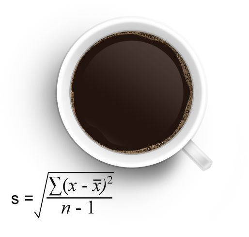

# A Taste of Functional Programming With CoffeeScript

This tutorial demonstrates some basic ideas in functional programming using CoffeeScript.

The approach here is to present easy to follow, hopefully intersting code which speaks for itself. I leave explanations of the complex inner workings of CoffeeScript/JavaScript to the official documentation and books published on these subjects.

## Why CoffeeScript?

CoffeeScript is designed to "expose the good parts of JavaScript in a simple way" [1]. CoffeeScript's clean synax makes it read and write like pseudocode (or Python, for people that are into that). 

Because under the hood CoffeeScript is just JavaScript, all the power that comes with that language is yours to command as well. From powerful functional programming techniques (the topic of this tutorial) to `npm`, there is nothing that CoffeeScript can't do which plain JavaScript can.

For the aspiring JavaScript developer, CoffeeScript can help you learn how to use JavaScript more effectively by making it easier to use features you should use. This is at least what I am believing as I write this tutorial.

Also, it's just fun. So why not? Let's dive in!

## Getting Started

Note that this tutorial uses CoffeeScript 2, the current working version of CoffeeScript as of December 2018.

### Prerequisites for this tutorial

You'll need basic familarity with the command line (navigate directories, create/modify/remove files). Likewise, you'll need a text editor. If you don't have a favorite yet, may I reccomend Microsoft's VSCode? Many things work right out of a fresh install. 

Another choice is [GNU Emacs](https://www.gnu.org/software/emacs/). Emacs has a [coffee-mode](https://github.com/defunkt/coffee-mode) which you can install using MELPA via `M-x package-install coffee-mode`.

## Let's Get Functional!

Pretty much all the widely used programming languages today incorporate features of **functional programming**. Functional programming has been called a 'paradigm' to contrast it with other ways of doing things like **declarative programming** and **imperative programming**.

Broadly speaking, each of these programming paradigms can be described as being dominated by some one central idea.

In practice, you don't have to choose between doing purely any one of these styles, and chances are you have done a little bit of them all if you do something like web development. For example, HTML/CSS can be said to be declarative because you declare to the client (usu. browser) what you want to be displayed and then the client goes and "figures it out" from the "program" you feed it. JavaScript is often used in an imperative manner, executing instructions step by step. 


### Re-introducing functions

Functional programming is all aboout **functions**. Just what are functions?

Let's define a simple function:

```coffee
coffee> double = (x) -> x * 2
[Function: double]
```

We can try it out on some different things:

```coffee
coffee> double 2
4
coffee> double 89
178
```
**Higher level functions** are... (get some compelling examples)

For more theory, you may want to explore **lambda calculus** or Haskell programming. Okay, let's get back to our coffee.

### map()

```coffee
coffee> arr1 = [1..10]
[ 1, 2, 3, 4, 5, 6, 7, 8, 9, 10 ]
coffee> arr2 = arr1.map double
[ 2, 4, 6, 8, 10, 12, 14, 16, 18, 20 ]
```

### filter()

Here is a short function that almost reads like English:

```coffee
coffee> isEven = (x) -> if x % 2 == 0 then true else false
```
Watch what `filter()` does.

```coffee
coffee> arr3 = arr1.filter isEven
[ 2, 4, 6, 8, 10 ]
```

Let's make another function:

```coffee
coffee> isOdd = (x) -> not isEven x
[Function: isOdd]
```

```coffee
coffee>[1..8].filter isOdd
[ 1, 3, 5, 7 ]
```

### reduce()

```coffee
coffee> adder = (sum, current_val) -> sum + current_val
[Function: adder]
coffee>[1..4].reduce adder
10 # A list is reduced to a single value
```
A slightly more sophisticated example:

```coffee
abbreviator = (abbreviation, current_item) ->
    abbreviation.concat("", current_item.toUpperCase())

funny = [ "functions", "usurp", "nations" ]
console.log funny.reduce(abbreviator, "")
```
```coffee
'FUN'
```

## What now?

So, maybe that was *fun...* But what are these higher level functions good for?

So far, we've been using CoffeeScript from the command line via the `coffee` REPL. We are going to move beyond that and actually save a file with a `.coffee` extension and run it with the `coffee` command.

In this repository, I have created a file called `index.coffee` which I can run via:

```
coffee index.coffee
```
Let's write a couple of functions to do some basic statistics. 

### Calculating Standard Deviation

Look into the coffee and recall the statistics you were supposed to study in grade school/university...



A brief guide to some of the symbols you may not remember here:

- *x*'s are the data points
- *x* with a bar over it ("x-bar") is the mean value of x's
- *n* is the number of values in the dataset

### Functional Solution

At the `coffee>` REPL, we wrote an `adder()` function earlier:

```coffee
adder = (sum, current_val) -> sum + current_val
```

This function can be used to take the sum of a list using `reduce()`. Note in the code that follows I will be following a convention commonly used with the Haskell programming language of calling some generic list `xs` (plural of `x`), while using `x` as a generic name for a single element of `xs`.

```coffee
sum = (xs) -> xs.reduce adder
```

Using the `sum()` function we just defined, we can easily define:

```coffee
mean = (xs) -> (sum xs) / xs.length
```

We'll use a couple of lines to make the calculation of variance a bit more readable: The exponential operator in CoffeeScript is `**`. 

```coffee
variance = (xs) -> 
    x_bar = mean xs
    numerator = sum xs.map (x) -> (x - x_bar)**2
    return numerator / (xs.length - 1)
```

Finally, to calculate standard deviation, we can use JavaScript's `Math.sqrt()` to take square roots.

```coffee
stdev    = (xs) -> Math.sqrt variance xs
```
Great! I tested the function we just wrote using a series of 
```
console.log std [ ...some list of numbers... ]
``` 
statements at the end of the file I was writing my functions in and comparing output against a desktop calculator I trust (namely, the [R programming language](https://www.r-project.org/)). Truly, there are more sophisticated ways to test these things, but we're just having fun here 😋

### But what about `filter()`?

I'm a no filter kind of person, so STFU! Just kidding...

Yes, we didn't use `filter()` in the examples above, but with a little creativity you can find many uses for it.

For example, imagine you create a function that returns `true` for values within a certain (plausible) range of values and `false` otherwise. A `filter()` on the original dataset can be used to sort out what we think our outliers from our 'real' data.


## Final Thoughts

Even if you don't use it in your normal development workflow, CoffeeScript's human-friendly offers a fine notation to scribble JavaScript on pieces of paper or idle napkins with ballpoint pens.

Hopefully spending some time with this new syntax was a pleasant experience, unlike managing transpilation, dependencies, external modules, etc. in CoffeeScript.

Time tells what will ultimately become of CoffeeScript specifically (and Bitcoin, for that matter), but the metaphor of a "language that exposes the best parts of JavaScript" will certainly live on as long as people use JavaScript.

## Notes and References

[1] From the official [CoffeeScript website](https://coffeescript.org/).

[2] [Master the JavaScript Interview: What is Functional Programming?](https://medium.com/javascript-scene/master-the-javascript-interview-what-is-functional-programming-7f218c68b3a0)